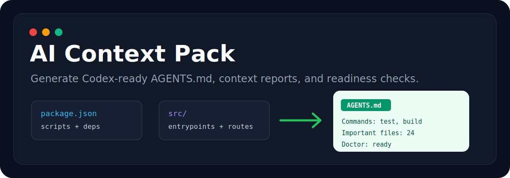
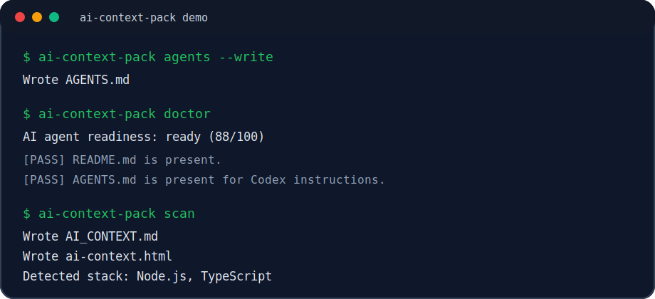

# AI Context Pack

<p align="center">
  
</p>

<p align="center">
  <a href="https://www.npmjs.com/package/ai-context-pack"></a>
  <a href="https://www.npmjs.com/package/ai-context-pack"></a>
  <a href="https://github.com/llljjjwww333/ai-context-pack/actions/workflows/ci.yml"></a>
  
  <a href="./LICENSE"></a>
</p>

<p align="center">
  Generate Codex-ready <code>AGENTS.md</code>, AI context reports, handoff prompts, and readiness checks for any repository.
</p>

<p align="center">
  <strong>English</strong> | <a href="#中文介绍">中文介绍</a>
</p>

---

## What It Does

`ai-context-pack` is a Codex-first onboarding tool for software repositories.

It scans a codebase, detects project structure, scripts, dependencies, environment variables, important files, Git context, and TODOs, then generates:

- `AGENTS.md` instructions that Codex can read automatically
- `AI_CONTEXT.md` for deeper repository context
- `ai-context.html` as a local visual report
- compact prompts for AI coding assistants
- an agent-readiness report with actionable fixes

Unlike repo-to-prompt tools that mainly pack source files into one large prompt, `ai-context-pack` focuses on the guidance layer that coding agents need before editing code: how the project is organized, how to install, build, test, and lint it, which files matter, and whether the repo is ready for AI-assisted development.

<p align="center">
  
</p>

## Install

Run without installing:

```bash
npx ai-context-pack scan
```

Or install globally:

```bash
npm install -g ai-context-pack
```

Requires Node.js 20 or newer.

## Quick Start

Generate Codex-ready project instructions:

```bash
ai-context-pack agents --write
```

Generate the detailed context report:

```bash
ai-context-pack scan
```

Check whether the repository is ready for AI coding agents:

```bash
ai-context-pack doctor
```

## Commands

| Command | Purpose |
| --- | --- |
| `ai-context-pack agents` | Print a concise `AGENTS.md` to stdout |
| `ai-context-pack agents --write` | Write `AGENTS.md` in the repo root |
| `ai-context-pack agents --link-context` | Link `AGENTS.md` to `AI_CONTEXT.md` |
| `ai-context-pack doctor` | Check whether the repo is agent-ready |
| `ai-context-pack doctor --json` | Print a machine-readable readiness report |
| `ai-context-pack scan` | Write `AI_CONTEXT.md`, `ai-context.html`, and cache |
| `ai-context-pack prompt` | Print a handoff prompt for AI coding assistants |
| `ai-context-pack diff` | Generate context focused on current Git changes |
| `ai-context-pack init` | Create `ai-context.config.json` |

## What It Detects

- Node.js, TypeScript, React, Vue, Svelte, Next.js, Vite
- Python, FastAPI, Django
- Go, Rust
- Docker and Render deployment files
- package scripts and install/build/test/lint commands
- environment variables from common code patterns
- entrypoints, API routes, data models, README files, manifests, config files
- Git branch, changed files, and recent commits
- TODO/FIXME items

## Example `AGENTS.md`

```md
# AGENTS.md

## Repository Overview

- This file was generated by `ai-context-pack` to help Codex and other coding agents onboard quickly.
- Detected stack: Node.js, TypeScript, Vite, React
- For the detailed generated context report, read `AI_CONTEXT.md`.

## Commands

- Install: `npm install`
- Run locally: `npm run dev`
- Build: `npm run build`
- Test: `npm test`
```

## Optional AI Summaries

The tool works fully offline by default. If `OPENAI_API_KEY` is set, long important files can be summarized through an OpenAI-compatible chat completions endpoint.

```bash
OPENAI_API_KEY=...
ai-context-pack scan
```

Use a compatible endpoint:

```json
{
  "model": {
    "enabled": true,
    "baseUrl": "http://localhost:11434/v1",
    "apiKeyEnv": "OPENAI_API_KEY",
    "name": "llama3.1",
    "maxInputChars": 24000
  }
}
```

Disable AI explicitly:

```bash
ai-context-pack scan --no-ai
```

## Configuration

Create `ai-context.config.json`:

```bash
ai-context-pack init
```

Example:

```json
{
  "include": ["**/*"],
  "exclude": ["node_modules/**", ".git/**", "dist/**", "build/**"],
  "maxFileBytes": 120000,
  "output": {
    "markdown": "AI_CONTEXT.md",
    "html": "ai-context.html",
    "cache": ".ai-context/cache.json",
    "agents": "AGENTS.md"
  },
  "agents": {
    "maxBytes": 32768,
    "linkContext": true
  }
}
```

## Why This Is Different

Repomix, GitIngest, and code2prompt are excellent tools for turning repository files into promptable text. `ai-context-pack` takes a different angle:

- Codex-first `AGENTS.md` generation
- agent-readiness checks via `doctor`
- compact onboarding instructions instead of source dumping
- detailed report available only when the agent or user needs it
- practical handoff prompts for day-to-day coding sessions

## Development

```bash
npm install
npm run typecheck
npm test
npm run build
```

## 中文介绍

`ai-context-pack` 是一个面向 Codex 和 AI 编程助手的仓库上下文生成工具。

它不会简单地把整个代码仓库塞进一个超长 prompt，而是自动整理 AI agent 真正需要的项目信息：项目结构、安装/启动/构建/测试命令、重要文件、环境变量、Git 改动、TODO/FIXME，以及项目是否适合被 AI 接手的检查结果。

它可以生成：

- `AGENTS.md`：Codex 会自动读取的项目指导文件
- `AI_CONTEXT.md`：详细的仓库上下文报告
- `ai-context.html`：本地可视化报告
- 可直接粘贴给 AI 编程助手的 handoff prompt
- `doctor` 检查结果：告诉你项目缺不缺 README、测试命令、环境变量示例、AGENTS.md 等

### 中文快速使用

不安装直接运行：

```bash
npx ai-context-pack scan
```

生成 Codex 友好的 `AGENTS.md`：

```bash
ai-context-pack agents --write
```

检查项目是否适合 AI agent 接手：

```bash
ai-context-pack doctor
```

生成详细上下文报告：

```bash
ai-context-pack scan
```

### 适合谁

- 想让 Codex 更快理解项目的开发者
- 想把项目交给 Claude Code、Cursor、Gemini CLI 等 AI 编程工具的人
- 想给开源项目补齐 AI agent onboarding 文档的人
- 想检查项目是否具备基本可维护性和可交接性的人

## License

MIT
